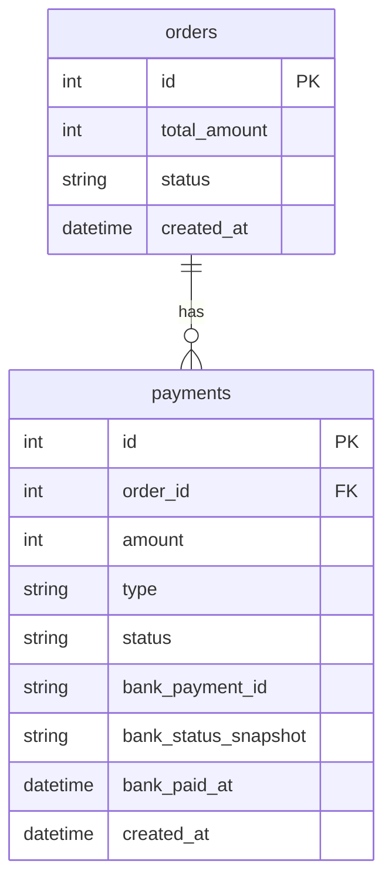

# DB Schema

```mermaid
erDiagram
    orders ||--o{ payments : has

    orders {
      int id PK
      int total_amount
      string status
      datetime created_at
    }

    payments {
      int id PK
      int order_id FK
      int amount
      string type
      string status
      string bank_payment_id
      string bank_status_snapshot
      datetime bank_paid_at
      datetime created_at
    }
```
